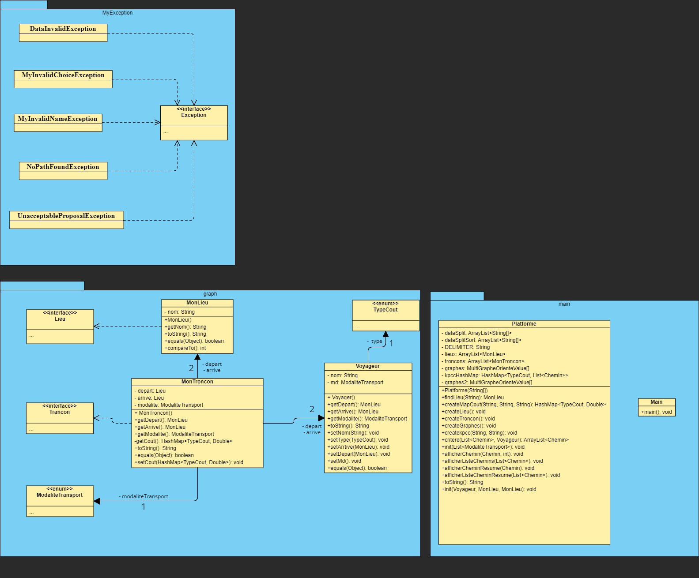
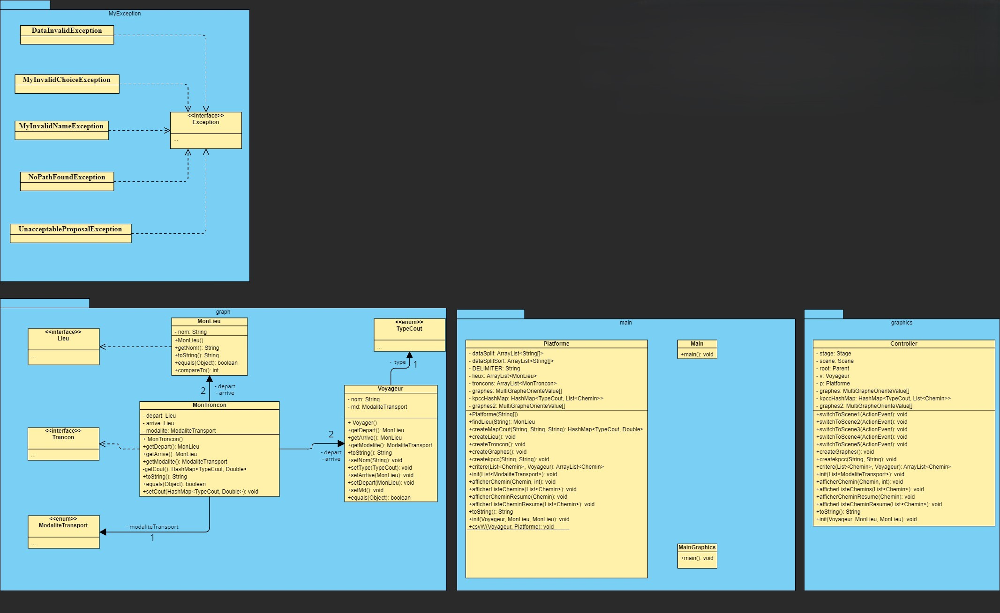
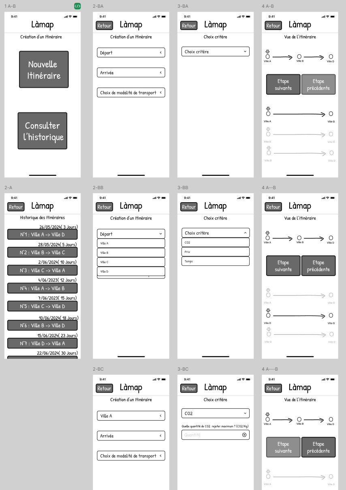
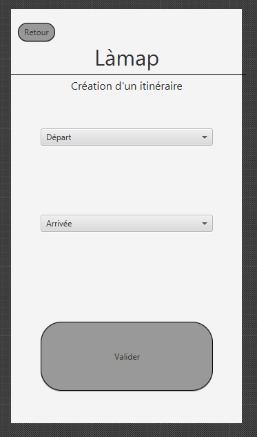

# SAE S2.02 -- Rapport pour la ressource DévOO

Auteurs : Yanis.E, Vincent.A, Yannis.D | Groupe F.

## Lancement du programme

Pour lancer le programme il faut éxecuter dans l'ordre les deux commandes suivante dans un terminale :

    > javac -d bin src/main/Main.java

    > java -cp bin main/Main

## Version 1 : un seul moyen de transport

Plusieurs classes et méthodes ont été nécessaire au bon développement de cette première version. Voici le diagrame **UML** :  

### Les méthodes les plus importante sont contenus dans `Platforme.java`

`void splitAndTri(ModaliteTransport moda)`
> Permet de découper les données en fonction de la modalité souhaitée.

---

`HashMap<TypeCout, Double> createMapCout(String prix, String co2, String temps)`
> Renvoie une HashMap ayant pour KEY le critère de tri de type String et en VALUE la valeur du critère de type double.

---

`void createLieu()`
> Permet de créer et ajouter à l'attribut lieux un nouveau MonLieu.

---

`void createTroncon()`
> Permet de créer et ajouter à l'attribut troncons un nouveau MonTroncon.

---

`void createGraphes()`
> Permet de créer tout les graphes nécessaire grâce au lieux et troncons.

---

`void createkpcc(String l1, String l2)`
> Permet de créer les chemins via l'algorithme de calcule du plus court chemins (kpcc) pour chaque critères.

---

`void init(ModaliteTransport moda)`
> Permet d'appeler les méthodes nécessaire à l'initialisation du programmes.

## Version 2 : multimodalité et prise en compte des correspondances

Pour cette version, nous avons dû modifier quelques méthodes et ajouter 3 classe d'exceptions, toute ces modifications sont retranscrite sur l'**UML** suivant :

### Certaines méthodes ont été modifiée ou ajoutée dans `Platforme.java`

`void splitAndTri(ModaliteTransport moda)`
> Même comportement que dans la Version 1, mais récupère les données depuis un CSV.

---

`void createkpcc(String l1, String l2)`
> Ajout d'une conditions vérifiant que les parametre ne sois pas nul, sinon la méthode jette une exception "NoPathFoundException".

---

`void init(ModaliteTransport moda)`
> Ajout d'appels de méthodes nécessaire a l'initialisation du programme.

### Ajout d'une nouvelle méthode

`void cheminMultiModa()`
> Permet d'incrémenter les coûts de different types en fonctions des correspondances.

---

`void init2(Voyageur v, MonLieu l1, MonLieu l2)`
> Séparation nécessaire de la méthode init() en 2 parties à cause de la classe Voyageur.

## Version 3 : optimisation multi-critères

Pour cette version, nous avons ajouté dans le package `main` une nouvelle classe `MainGraphics.java` et un nouveau package `graphics` où se situe une nouvelle classe `Controller.java` ainsi que leurs méthodes respectivent.

Une nouvelle méthode `void csvW(Voyageur v, Platforme p)` a été introduite à la classe `Platforme.java` pour permettre l'écriture de l'historique dans un CSV afin de le sauvegarder.

D'autre méthodes ont été ajoutée et spécifier sur l'UML suivant :

Cette version a aussi été doté d'une interface graphique réalisé avec **JavaFx** et **Scene Builder**. Une interface graphique issue d'un prototypage réalisé sur [**Figma**](https://www.figma.com/fr-fr/).

### Prototypage basse fidélité (Figma)

Ce prototype est disponible dans le **readme**.

### Réalisation du prototypage haute fidélité (Scene Builder)

> **Bien que le travail a été éffectué, JavaFx ne fonctionne pas chez nous, cette interface graphique a donc été réalisé mais n'as pas pu être testé.**

Le travail a été éffectué en utilisant `live share` nous permettant de travailler tous ensemble sur les même fichier en temps réel.