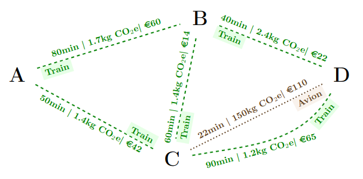
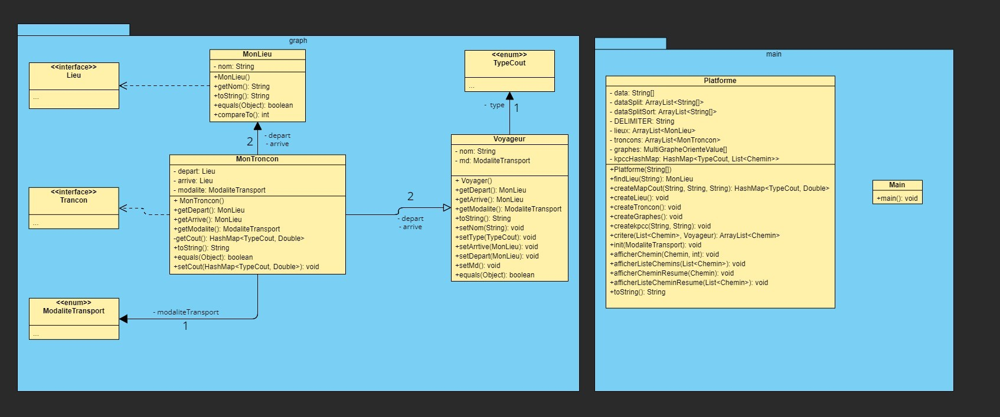
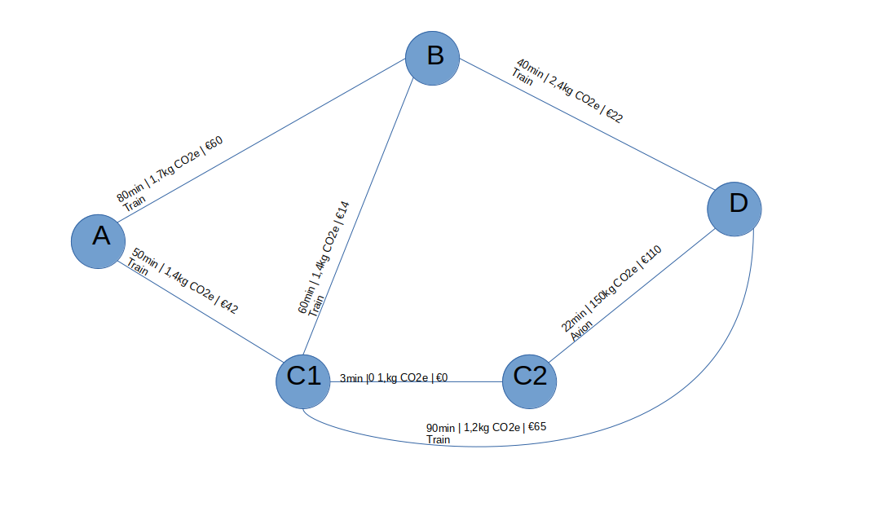

<!-- Votre rapport doit suivre le plan donné dans ce document.

Contraintes à respecter pour le rapport

- [ ] format: Markdown qu'on peut lire sur gitlab, ou pdf, ou html
- [ ] rapport dans un répertoire `graphes` à la racine du dépôt git
- [ ] rapport prêt le 21/06/2024; aucun délai supplémentaire ne sera accordé quelle que soit la raison donnée. Concrètement, on va récupérer la dernier daté au plus tard le 21/06/2024 et on ne verra même pas de version ultérieure du rapport, si elles existent. Minuit et une minute du 22/06/2024 sera trop tard
- [ ] respecte le plan donné ci-dessous
- [ ] garder les explications *en italique* jusque la fin pour s'y référer en écrivant le rapport
- [ ] supprimer les explications *en italique* juste avant de rendre la version finale du rapport
- [ ] le rapport est un texte **rédigé** avec des phrases intelligibles (on ne se contente pas de répondre laconiquement aux questions posées)

Idéalement, le rapport est rédigé au fur et à mesure avec le calendrier donné dans le sujet:

- section Version 1 faite avant le 18/05/2024 (1pt/20 si c'est le cas)
- section Version 2 faite avant le 08/06/2024 (1pt/20 si c'est le cas)

Finalement, l'utilisation d'un outils de génération de langage est autorisées, à condition de le faire intelligemment. En particulier, veillez à:

- avoir un rapport cohérent avec un style cohérent sur la totalité du document (niveau de langage, richesse du vocabulaire, termes utilisés, verbosité, ...)
- un rapport trop verbeux est fastidieux à lire. Si vous utilisez un outil pour faire du texte verbeux inutile, on utilisera un outil pour en faire un résumé et on corrigera uniquement le résumé
- les outils de génération insèrent parfois des phrases ne faisant pas partie du texte, mais qui s'adressent à l'interlocuteur (par exemple, pour vous informer que la limite de 2000 tokens est atteinte). La présence de telles phrases dans le rapport indique que vous n'avez pas relu et sera lourdement pénalisée.

**Début du rapport** Tout ce qui précède sera enlevé pour la version finale

\------------------------------------------ -->

# SAE S2.02 -- Rapport pour la ressource Graphes

Auteurs : Yanis.E, Vincent.A, Yannis.D | Groupe F.

## Version 1 : un seul moyen de transport

<!-- *Cette section traite uniquement de la Version 1 du projet.* -->

### Présentation d'un exemple

<!-- *Présenter un exemple concret de problème (données complètes pour la plateforme avec tous les moyens de transport, préférences de l'utilisatrices qui comprennent le moyen de transport choisi, le critère d'optimisation, et nombre d'itinéraires demandés).*
*Donner la solution du problème du point de vue de l'utilisatrice, càd quels sont les itinéraires possibles, quels sont les meilleurs itinéraires et pourquoi.*
*Pour l'instant on ne parle pas de graphes; on peut éventuellement faire des schémas.* -->

En utilisant le graphe présenté si dessous, imaginons une utilisatrice nommée Claire qui doit se rendre à une conférence à D. Elle habite à A et souhaite trouver l'un des meilleur itinéraire possible. Les moyens de transport disponibles incluent le train et l'avion. Elle souhaite trouver plusieurs itinéraire répondant le plus possible à ses préférences.

Les préférences de l'utilisateur doivent pouvoir être choisis en fonction de ma modalité de transport souhaiter, du nombre de destination et d'un ou plusieurs critères de voyage tel que le temps du trajet, le prix ou encore le rejet en CO2.

Par exemple, si elle choisis de ne prendre que le train pour ne pas polluer, et avoir les trajets les moins couteux, le programme ne calculera que des trajet par train les moins chère possible de A vers D. On peut ajouter un critère secondaire tel que le temps ou le CO2.

### Modèle pour l'exemple

<!-- *Donner le graphe modélisant l'exemple ci-dessus.*
*Donner la solution du problème (càd les meilleurs itinéraires) en tant que chemins dans le graphe.* -->

Ici, pour aller de A vers D comme Claire en souhaitant le chemin le plus court, c'est à dire le plus rapide, ce serait le chemin [A,B,D] pour lequel le temps est de 120 minutes.

### Modélisation pour la Version 1 dans le cas général

<!-- *Expliquer de manière abstraite comment, étant donné un problème de recherche d'itinéraire (plateforme avec tous types de lignes, moyen de transport choisi, critère d'optimisation, nombre d'itinéraires demandés) on peut construire un graphe permettant de résoudre le problème de recherche d'itinéraire. C'est à dire:*

- *quels sont les sommets du graphe par rapport aux données du problème*,
- *quelles sont ses arêtes, par rapport aux données du problème*,
- *comment sont définis les poids des arêtes*,
- *quel algorithme sur les graphes permet de résoudre le problème d'itinéraire (nom de l'algorithme, arguments).*

*Utiliser un vocabulaire précis sur les graphes.* -->

Pour construire un graphe permettant de résoudre le problème de recherche d'itinéraire, il nous faut :

* plusieurs sommets qui sont représentés par des villes en l'occurence : A,B,C,D.

* Plusieurs arêtes qui permettent de relier les villes entre elles, ici :
  * A - B (Train)
  * A - C (Train)
  * B - C (Train)
  * B - D (Train)
  * C - D (Avion)
  * C - D (Train)

* Le poid des arêtes sont définis par 3 critères au choix qui sont :
  * Le temps exprimé en minutes.
  * Le rejet de CO2 exprimé en kg CO2e.
  * Le prix du trajet en euros. (€)

* L'algorithme utilisé pour le calcule du plus court chemin (pcc) est l'algorithme de Dijkstra qui prend un graphe orienté ou non et valué positif en entrée.

### Implémentation de la Version 1

Pour modéliser notre projet, nous avons réaliser un diagramme UML représentant chaque classe à implémenter.

###  ClaireTest.java  

Une de nos classes de test s'appelle **PlatformeTest.java** et permet construire un graphe et de tester certaine méthodes de Platforme.java. 

Il y a aussi **ClaireTest.java** qui lui construit un graphe repris de l'exemple de Claire pour ensuite pouvoir calculer et renvoyer le bon chemins.

* Date du commit : 20/05/2024

*  [Lien du commit](https://gitlab.univ-lille.fr/sae2.01-2.02/2024/F4/-/commit/bbd43acf5f1d796be56b6849a635ef0645146289) : bbd43acf5f1d796be56b6849a635ef0645146289

* [Lien du fichier sur Gitlab](https://gitlab.univ-lille.fr/sae2.01-2.02/2024/F4/-/blob/main/test/main/ClaireTest.java?ref_type=heads)

<!-- *Écrire une classe de test qui reprend l'exemple, définit toutes les données de la plateforme, construit le graphe et calcule la solution.*
*Votre classe peut utiliser des assertions (test unitaire) ou bien afficher la solution.*
*Donner ici le **nom complet de la classe**, **la date et l'identifiant du commit à regarder** et un **lien vers la page de cette classe sur gitlab qui correspond au bon commit***.

*On insiste sur l'importance de spécifier le commit. En effet, quand vous commencerez la Version 2, le code utilisé pour le test de la Version 1 sera modifié. Il se peut que vous n'ayez pas le temps de finaliser la Version 2 et vous retrouver avec un code qui ne marche pas même pour la Version 1. C'est pourquoi il est important de rédiger le rapport au fur et à mesure et de donner ici un lien vers la version de votre code qui marche pour la Version 1 du projet.* -->

## Version 2 : multimodalité et prise en compte des correspondances

<!-- *Cette section explique la solution pour la Version 2 du projet.* -->
Dans cette seconde version, il fallait rajouter des correspondances dans les villes. De ce fait, nous avons rajouté une **List de tableau de String** afin de pouvoir stocker et manipuler chaque correspondance. Nous l'avons ajouté dans la classe **MonLieu**, car chaque correspondance se trouve dans la ville.

### Présentation d'un exemple

<!-- *Présenter un exemple concret (plateforme, couts de correspondance, critère d'optimalité).* -->
Finalement, la conférence de Claire a été avancée. Elle décide donc de se rendre à la ville D le plus rapidement possible. De ce fait, elle décide de prendre l'avion de manière exceptionnelle. La ville C possède une gare et un aéroport. Claire a rajouté la modalité de transport **"Avion"** dans son itinéraire donc une correspondance a été réalisé entre la gare et l'aéroport.
<!-- *Donner la solution du problème du point de vue de l'utilisatrice (quels sont les itinéraires possibles, lesquels sont optimaux et pourquoi).*
*Il est possible d'utiliser le même exemple que pour la Version 1 ou le modifier si pertinent.* -->

### Modèle pour l'exemple

<!-- *Donner le graphe modélisant l'exemple ci-dessus.* -->

<!-- *Donner la solution du problème (càd les meilleurs itinéraires) en tant que chemins dans le graphe.* -->

* Le sommet C a été dupliqué : 
  * C1 et C2

* Ce qui crée une nouvelle arrête :
  * C1 - C2 (Correspondance)

L'itinéraire optimal proposé à Claire est de partir de la ville A passant par la ville C, marcher jusqu'à l'aéroport de la ville C et prendre l'avion pour arriver à la ville D. Pour avoir le chemin le plus optimal, Claire décide donc de marcher de la gare à l'aéroport de la ville C. D'autre itinéraires sont proposés, mais le plus optimale reste celui où il faut utiliser l'avion.

### Modélisation pour la Version 2 dans le cas général

<!-- *Mêmes questions que pour la section correspondante de la Version 1, mais cette fois-ci les données d'entrée contiennent aussi des couts de correspondance.* -->
L'utilisateur pourra rentrer deux critères de sélection afin de pouvoir visualiser quel graphe est le plus adapté au critère demandé. Ce critère s'applique sur tous les chemins y compris les correspondances.
<!-- *Vous pouvez expliquer l'entièreté de la solution pour la Version 2, ou bien indiquer **clairement** les différences par rapport à la solution proposée pour la Version 1.* -->
Pour calculer quel chemin est le plus adapté aux critères demandé, nous avons additionné le coût des critères sélectionne en y comptant aussi les correspondances.

### Implémentation de la Version 2

<!-- *Écrire une classe de test qui reprend l'exemple, définit toutes les données de la plateforme, construit le graphe et calcule la solution.*
*Votre classe peut utiliser des assertions (test unitaire) ou bien afficher la solution.*
*Donner ici le **nom complet de la classe**, **la date et l'identifiant du commit à regarder** et un **lien vers la page de cette classe sur gitlab qui correspond au bon commit***.
-->

* Nom de la classe : **ClaireTest2.java**
* Date : **7/06/2024**
* ID Commit : **11678edf7a3b999cb5690047476ac6b5d9c3183d**
* URL Commit : **https://gitlab.univ-lille.fr/sae2.01-2.02/2024/F4/-/blob/11678edf7a3b999cb5690047476ac6b5d9c3183d/test/main/ClaireTest2.java**  

<!-- *En particulier, il peut s'agir de la même classe que celle donnée pour la Version 1, mais un commit différent.*  -->

## Version 3 : optimisation multi-critères

<!-- *Suivre le même plan que pour les deux autres sections.*
*Pour l'exemple, veillez à spécifier toutes les données des problèmes. En particulier, on ajoute ici l'expression des préférences d'optimisation de l'utilisatrice.*
*Comme précédemment, il est possible d'utiliser le même exemple et simplement l'enrichir.* -->

Dans cette dernière version, nous devions faire en sorte que l'utilisateur puisse réaliser un itinéraire avec plusieurs critères. De ce fait, nous faisons le tri sur chaque chemin avec le premier et le second critère validé. Nous rassemblons les deux listes afin d'avoir les chemins qui répondent aux deux besoins. De plus, nous devons implémenter un historique permettant de reprendre un itinéraire déjà réalisé. L'historique permet de stocker les données du chemin (**Temps**, **CO2**, **Prix**, **Chemin**) dans un fichier **csv** crée pour l'occasion avec le nom de l'utilisateur.

### Présentation d'un exemple

Claire a pu participer à sa conférence grâce à l'itinéraire qu'elle a pu emprunter. À la ville de sa conférence, elle a trouvé des boutiques intéressantes. De ce fait, elle souhaite reprendre le même itinéraire mais elle veut toujours avoir le moins de **Temps** de trajet et produire le moins de **CO2** possible. Elle va alors chercher son ancien itinéraire qu'elle avait déjà réalisé pour aller à sa conférence.

### Modèle pour l'exemple

* Claire choisie deux critères pour pouvoir créer l'itinéraire. Elle a le choix entre : 
  * **Prix**
  * **CO2**
  * **Temps**

* Claire crée l'itinéraire, cet itinéraire est stocké dans un fichier csv sous le nom de **Claire.csv**. 

* Cet itinéraire est réutilisé pour pouvoir le remprunter. 

### Modélisation pour la Version 3 dans le cas général

L'utilisateur pourra rentrer deux critères comme dans les versions précédentes. Lors de la création de l'itinéraire, l'application va créer un fichier csv au nom de l'utilisateur. Dans celui-ci il sera inscrit plusieurs données comme l'émission de CO2, le prix du trajet, le temps du trajet et le chemin à emprunter pour arriver à la destination.

(Lors du début du projet, nous avions déjà réalisé la fonction du multi critère. C'est pour cela que la version n°3 nous avions moins de contenu.)

### Implémentation de la Version 3

* Nom de la classe : **ClaireTest3.java**
* Date : **17/06/2024**
* ID Commit : **47748fac206c809d7a24647a97e7e289c0d65470**
* URL Commit : **https://gitlab.univ-lille.fr/sae2.01-2.02/2024/F4/-/blob/47748fac206c809d7a24647a97e7e289c0d65470/test/main/ClaireTest3.java**

---

**Fin du rapport**

### Barème sur 30 pts

Toute question sur le barème est à adresser à iovka.boneva@univ-lille.fr

- Rapport non rendu à temps -> note 0
- **(7, décomposé comme suit)** Divers
  - **(1,5)** Respect de la structure du rapport
  - **(1,5)** Section Version 1 rendue pour le 18/05/2024. Cette version peut contenir les parties en italique.
  - **(1,5)** Section Version 2 rendue pour le 08/06/2024. Cette version peut contenir les parties en italique.
  - **(1)** Utilisation de vocabulaire précis sur les graphes (termes vu en cours, noms des algorithmes, etc.)
  - **(1,5)** Style d'écriture fluide et compréhensible
- **(8, décomposé comme suit)** Solution pour la Version 1
  - **(2)** Exemple pertinent (illustre tous les aspects du problème) et lisible (en particulier, ni trop grand ni trop petit, bien présenté)
  - **(4)** Le modèle de l'exemple permet de trouver la solution sur l'exemple. La modélisation pour le cas général permet de résoudre le problème posé
  - **(2)** L'implémentation de l'exemple est correcte et fonctionnelle
- **(6, décomposé comme suit)** Solution pour la Version 2
  - **(1)** Exemple pertinent
  - **(4)** le modèle de l'exemple permet de trouver la solution sur l'exemple. La modélisation pour le cas général permet de résoudre le problème posé
  - **(1)** L'implémentation de l'exemple est correcte et fonctionnelle
- **(3)** Qualité de la description de la solution (concerne les sections "Modèlisation dans le cas général" pour les Versions 1 et 2):
  - La modélisation pour le cas général est décrite de manière abstraite mais précise et complète. Pour vous donner une idée, un·e étudiant·e de BUT qui a validé les ressources Graphes et Dev devrait être en mesure d'implémenter votre solution d'après la description que vous en faites, sans avoir à trop réfléchir.
- **(6)** Solution pour la Version 3: mêmes critères que pour la Version 2