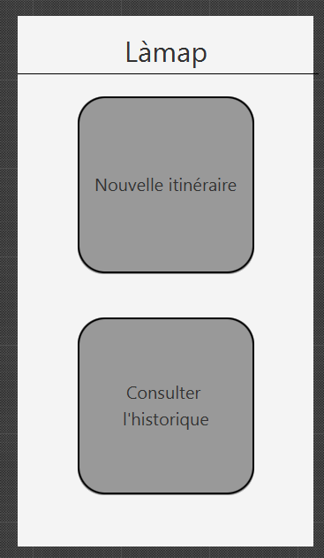

— une partie sur la justification de vos choix de conception au regard des critères ergonomiques,
guide de conception. . .(cela servira notamment à évaluer la compétence 5 "identifier les besoins
métiers des clients et des utilisateurs" de R2.02)

# SAE S2.02 -- Rapport pour la ressource IHM

Auteurs : Yanis.E, Vincent.A, Yannis.D | Groupe F.

*Lien vers le GitLab:* https://gitlab.univ-lille.fr/sae2.01-2.02/2024/F4

## Justification de nos choix

Guidage : tout se fait par page, donc tout est séparer par "étape", cela rend la chose harmonieuse.

Charge de travail : nous avons fait des boutons simple à comprendre et des textes court.

Gestion des erreurs : affiche un message d'erreur si les limites des critères sont incorrectes.

Homogénéité : toute l'interface est dans le même style, comme ça l'utilisateur n'est pas surpris.

Signifiance des codes et dénominations : nous pensons que toute l'interface est simple à comprendre même pour les non-initiés.

Nous avons appliqué plusieurs lois de Gestalt : 
    Loi n°1 Nous avons utilisé des formes simples afin que l'utilisateur se retrouve dans l'application.
    Loi n°2 Les widget se trouvant proche les uns-des autres appartiennent aux même groupe de fonctionnalités.
    Loi n°4 Nous avons fait en sorte que les widgets appartenant au même groupe de fonction ai une forme similaire

### Contribution

|Taches:| Yanis | Vincent | Yannis |
| :----------- | :--------------: | -------------------------: | -------------------------: |
|Brainstorming| Oui | Oui | Oui |
|Developpement| Oui | Oui | Oui |
|Testing| Non | Oui | Non |
|Debug| Oui | Non | Oui |
|Redaction des rapports| Oui | Oui | Oui |
|Conception de l'interface| Oui | Oui | Oui |
|Création de la vidéo | Non | Oui | Oui |

### Plus

**Nous avons eu une erreur lors de la création de l'interface, que nous n'avons pas réussi à résoudre même en changeant de machine. Nous avons quand même fais du code et fait le `F4.jar` qui lui fonctionne, mais nous n'avons malheureusement pas pu executé le code**

Le travail a été éffectué en utilisant `live share` nous permettant de travailler tous ensemble sur les même fichier en temps réel.

